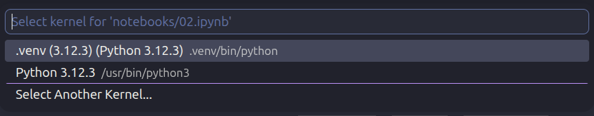
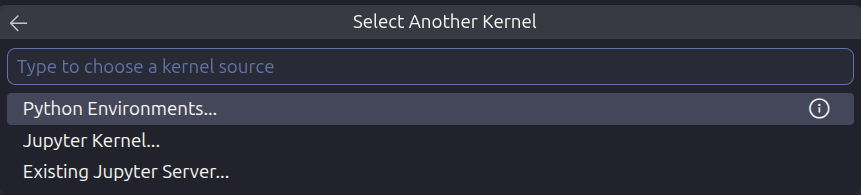
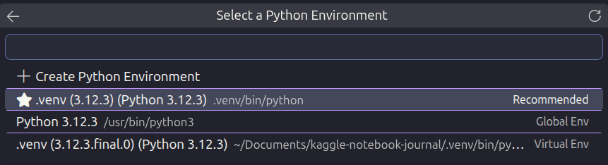

# Data Science Project Setup Guide

This document contains the common setup steps I use when starting a new
Data Science / Machine Learning project.

---

# 1. Check Python Installation

Check Python version

```bash
python3 --version
````

Check pip version

```bash
pip3 --version
```

Why?

* Ensures Python is installed.
* Confirms pip is available.

---

# 2. Create a Virtual Environment

Create a virtual environment

```bash
python3 -m venv .venv
```

Why?

A virtual environment creates an isolated Python environment for this
project.

Benefits

* Prevents package conflicts
* Keeps each project independent
* Easy to recreate later
* Professional practice

Project Structure

```

project/
│
├── .venv/
├── src/
├── notebooks/
└── ...

```

---

# 3. Activate the Virtual Environment

Linux / Ubuntu

```bash
source .venv/bin/activate
```

Successful activation looks like

```text
(.venv)
```

To deactivate

```bash
deactivate
```

---

# 4. Upgrade pip

```bash
python -m pip install --upgrade pip
```

Why?

Keeps the package manager updated.

---

# 5. Install Required Packages

Example

```bash
pip install pandas numpy matplotlib jupyter notebook ipykernel
```

Current Packages

* pandas
* numpy
* matplotlib
* jupyter
* notebook
* ipykernel

Install additional packages only when the project requires them.

---

# 6. Register Jupyter Kernel

```bash
python -m ipykernel install --user \
--name=hospital-readmission \
--display-name="Python (Hospital Readmission)"
```

Why?

Allows VS Code and Jupyter Notebook to use the project's virtual environment.

---

# 7. Select VS Code Interpreter

Open Command Palette

```

Ctrl + Shift + P

```

Choose

```

Python: Select Interpreter

```

Select

```

.venv/bin/python

```

Notebook Kernel

```

Python (.venv)

```

---

# 8. Freeze Dependencies

Generate requirements.txt

```bash
pip freeze > requirements.txt
```

Why?

Records every installed package and version.

Anyone can recreate the environment using

```bash
pip install -r requirements.txt
```

Never edit requirements.txt manually.

Regenerate it after installing new packages.

---

# 9. Create .gitignore

Create

```
.gitignore
```

Example

```gitignore
# Virtual Environment
.venv/

# Python Cache
__pycache__/
*.py[cod]

# Jupyter
.ipynb_checkpoints/

# VS Code
.vscode/

# Environment Variables
.env

# macOS
.DS_Store

# Linux Temporary Files
*~
```

Why?

Git tracks every file by default.

.gitignore tells Git which files should NOT be tracked.

Examples

Ignored

* .venv/
* **pycache**/
* .ipynb_checkpoints/
* .vscode/

Tracked

* README.md
* notebooks/
* src/
* docs/
* requirements.txt
* data/

---

# 10. Git Workflow

Check repository status

```bash
git status
```

Add files

```bash
git add .
```

Commit changes

```bash
git commit -m "Meaningful commit message"
```

Push changes

First push

```bash
git push -u origin master
```

(or `main`, depending on your default branch)

Future pushes

```bash
git push
```

---

# 11. Understanding Git Push

Git has two repositories

Local Repository

Your computer

Remote Repository

GitHub

The first push connects the local branch to the GitHub branch.

```bash
git push -u origin master
```

After that

```bash
git push
```

is enough.

---

# 12. Choosing the Jupyter Kernel (VS Code)

When opening a Jupyter Notebook (`.ipynb`) in VS Code, select the project's virtual environment as the kernel.

## Selection Steps

1. **Select Another Kernel...**
2. **Python Environments...**
3. Choose the interpreter whose path ends with:

```text
.venv/bin/python
```

### Select

```text
Workspace → .venv → .venv/bin/python
```

### Do Not Select

```text
Global → /usr/bin/python3
```

## Notes

- Multiple `.venv` entries may appear in VS Code. This is normal.
- Always select the interpreter whose path ends with:

```text
.venv/bin/python
```

- Do not select the global Python interpreter (`/usr/bin/python3`).

## Why?

- Uses the project's isolated virtual environment.
- Ensures the correct package versions are used.
- Prevents dependency conflicts between projects.
- Maintains consistency with `requirements.txt`.

## Rule

> **One Project → One Virtual Environment (.venv) → One Workspace Kernel**

## Verification

Check the active interpreter:

```bash
which python
```

Expected output:

```text
.../project-name/.venv/bin/python
```

If the output is:

```text
/usr/bin/python3
```

the virtual environment is not active.





